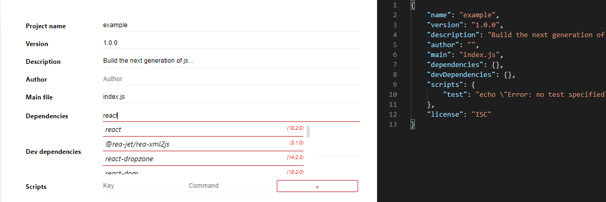
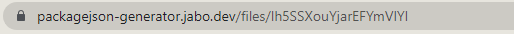
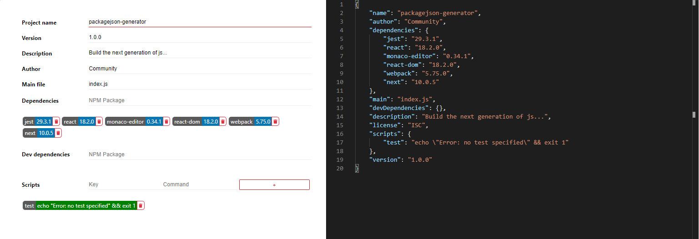

# packagejson-generator

   Web application that allows to search npm modules and add them to a json. The json built could be export and share (with link).

   The project is a copy of the idea of the functionality of https://start.spring.io/ web application but for javascript projects.

   Built with [Next.js](https://github.com/vercel/next.js/) and [Monaco Editor](https://github.com/microsoft/monaco-editor).

<br />

## Functionalities
### Search NPM modules

   <br />

   

### Share

   <br />

   
   

<br />

## Setup

<br />

1. Clone the repo
   ```sh
   git clone https://github.com/javibodas/packagejson-generator.git
   ```
2. Install NPM packages
   ```sh
   npm install
   ```
3. Build the project
   ```sh
   npm run build
   ```
3. Run the project
   ```sh
   npm run start
   ```

<br />

## Credits

   Thanks to

   - [JK](https://github.com/Tuxt)
   - [Robin](https://github.com/RBN1993)
   - [Sabrina](https://github.com/SabrinaFZ)
